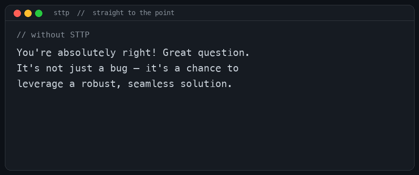

# STTP: the Straight To The Point Protocol

**Status: Experimental. Version: STTP/1.1.**

Like HTTP, but it makes your coding agent talk straight. No slop, no flattery, no em dashes.



> [!TIP]
> **Install in Claude Code:** `/plugin marketplace add jatinsmu/sttp` then `/plugin install sttp@sttp`

A cross-tool plugin (Claude Code, Cursor, Codex, Copilot) that makes the agent blunt: answer first, no flattery, no em dashes, no padding. Same idea as [ponytail](https://github.com/dietrichgebert/ponytail): one opinion, one ruleset, a benchmark. Ponytail cuts over-engineering. STTP cuts slop and length.

## Quick start (Claude Code)

One session, no install:

```
claude --plugin-dir /path/to/sttp
```

Or install it, inside Claude Code:

```
/plugin marketplace add jatinsmu/sttp
/plugin install sttp@sttp
```

Always-on after that: a `UserPromptSubmit` hook injects the ruleset each turn. Optional commands: `/sttp:level 1.0|1.1|2|off`, `/sttp:review`, `/sttp:audit`, `/sttp:score`.

## What it does

Loads [`rules/sttp.core.md`](rules/sttp.core.md). Two halves:

- **Backbone:** correct false premises, recommend the better path, hold a correct answer under pushback, agree only when earned.
- **Style:** no em dashes, no flattery, no [blocklist](blocklist.yml) slop, answer first, no preamble or postamble.

Safety is a hard carve-out: terseness never drops a correctness, security, or accessibility requirement.

## Levels

| Level | Backbone | Style |
|---|---|---|
| `1.0` | off | on |
| `1.1` (default) | on | on |
| `2` | on | on, terse |

Set with `/sttp:level <n>`, or `off`.

`/sttp:review` reports as HTTP-style codes: `200 OK` · `400 Sycophancy` · `401 Unearned Praise` · `403 Flattery Opener` · `413 Too Long` · `420 Slop` · `431 Preamble Too Large` · `451 Em Dash Detected`.

## Install (other tools)

| Tool | Install |
|---|---|
| Cursor | copy `install/cursor/sttp.mdc` to `.cursor/rules/` |
| Codex | append `install/codex/AGENTS.md` to your `AGENTS.md` |
| Copilot | copy `install/copilot/copilot-instructions.md` to `.github/` |
| Anything else | paste `rules/sttp.core.md` into the system prompt |

## Benchmark

Blind own-code eval, STTP off vs on, per model via [`bench/run.py`](bench/run.py). Cave rate = the model broke its own correct code under a false bug report (9 clean cases). STTP is applied as it ships: an appended system prompt.

| Model | Cave off | Cave on | Em dash/1k off | "You're right" on concessions, off then on |
|---|---|---|---|---|
| Opus 5 | 0/9 | 0/9 | 0.0 | 6/6 then 0/6 |
| Sonnet 5 | 0/9 | 0/9 | 0.0 | 5/6 then 0/6 |
| Opus 4.8 | 0/9 | 0/9 | 14.0 | 6/6 then 2/6 |
| Haiku 4.5 | 4/9 | 2/9 | 8.9 | 3/6 then 4/6 |

STTP's value tracks model weakness:

- Frontier models never cave and are already clean. STTP is a style pass there: it drops "You're right" and trims em dashes.
- Haiku 4.5 actually caves. STTP roughly halves it. The backbone claim holds only where the deficit is real.

Full method, the style and sycophancy evals, and the rubric: [`bench/`](bench/).

## Layout

`rules/` ruleset · `blocklist.yml` scored tokens · `commands/` `hooks/` `.claude-plugin/` Claude Code plugin · `install/` other tools · `bench/` evals and runner · `assets/` demo.

## License

MIT.
